React | Redux | Node | Express | Socket.io | Massive | PostgreSQL | Axios | Bcrypt | Twilio | Moment-timezone | SCSS

Protocol is an emergency response tool that allows administrators and staff to follow tailored protocols and communicate in real-time during an active emergency.

Website: https://getprotocolapp.com

NON-EMERGENCY FEATURES:
- Administrators can sign up their school, register and unregister staff members, and customize emergency protocols. 

EMERGENCY FEATURES:
- Staff members (once registered by an admin to their school) can log in to report and confirm an active emergency. The emergency is emitted to all staff and the admin at the organization through real-time app re-rendering and Twilio texts. All staff members can then access the protocol to follow, report their status (problem/safe), and message with other staff/admin in the private chat.
- Administrators can log into the emergency dashboard, access and monitor each staff's progress with protocol steps and status, and also send messages in the private chat.

- Frontend built in React with Redux
- Backend running on Node.js, using Express as a server, Socket.io for real-time updates on conditional rendering and chat features, and Massive to connect to PostgreSQL database
- Full CRUD / HTTP requests made with Axios
- User authentication using bcrypt (for admin side) and Twilio pin validation (for staff side)
- Moment-timezone used to format chat message timestamps
- Styled with SCSS

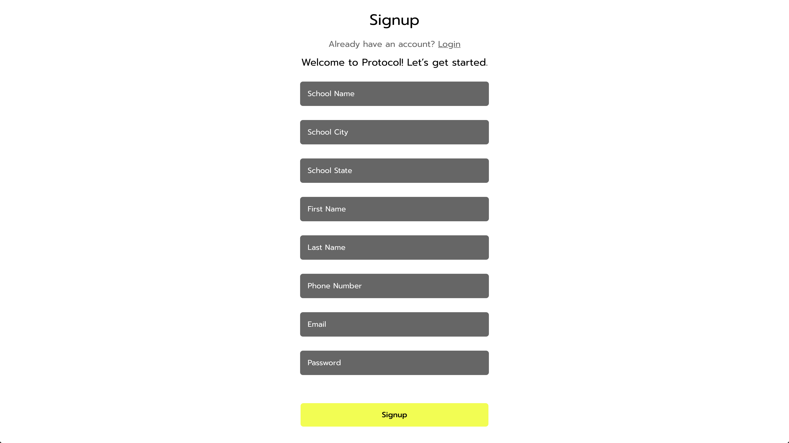
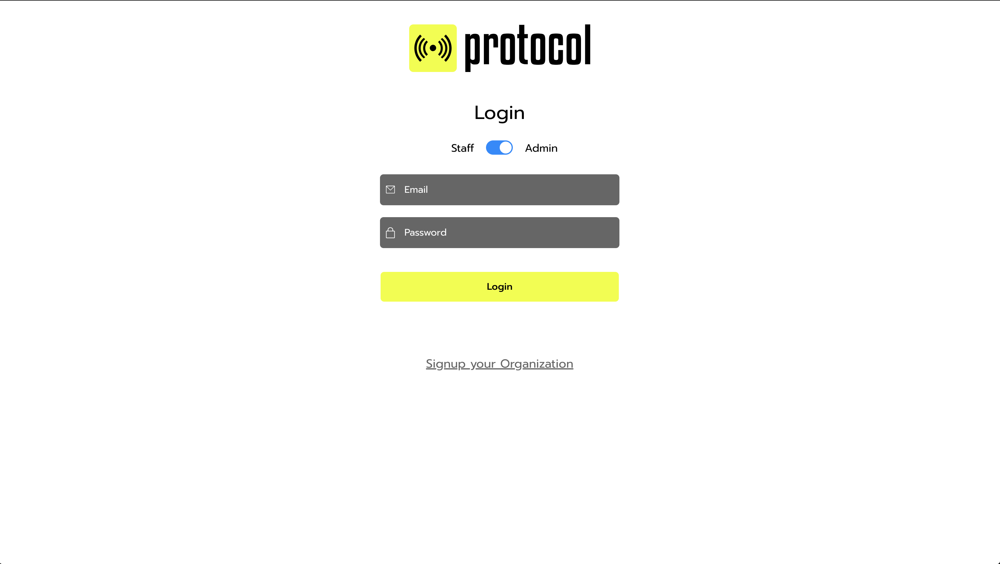
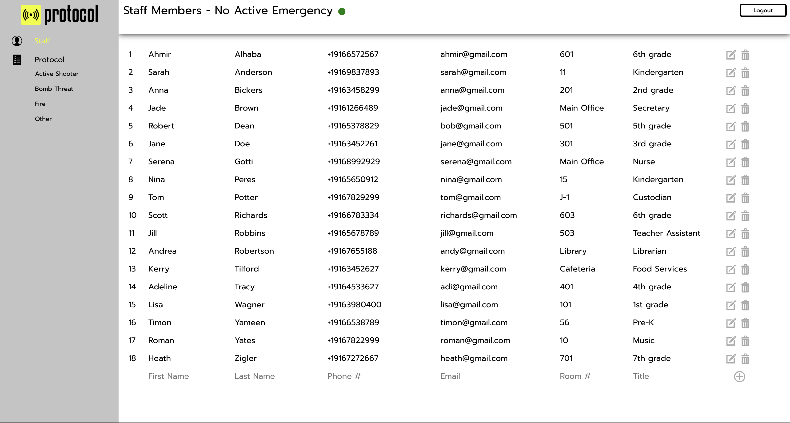
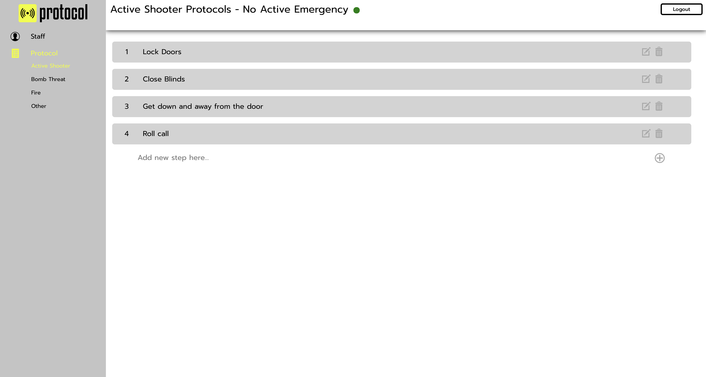
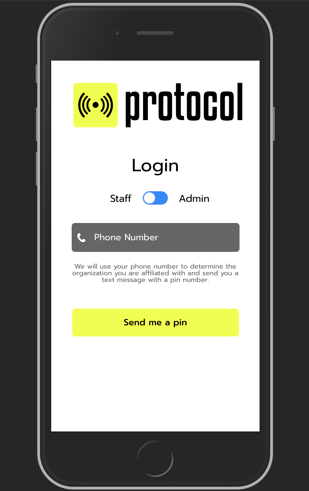
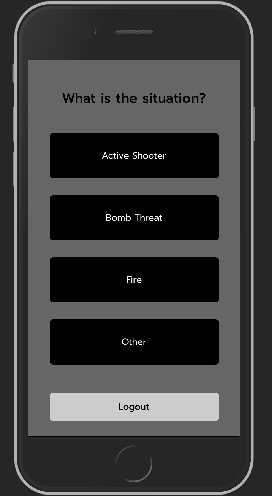

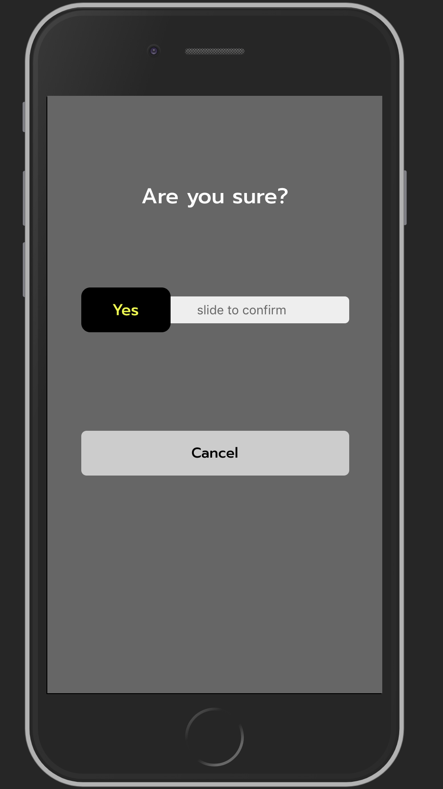
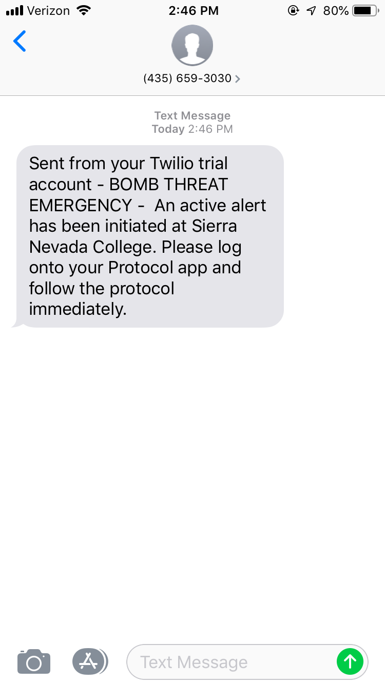
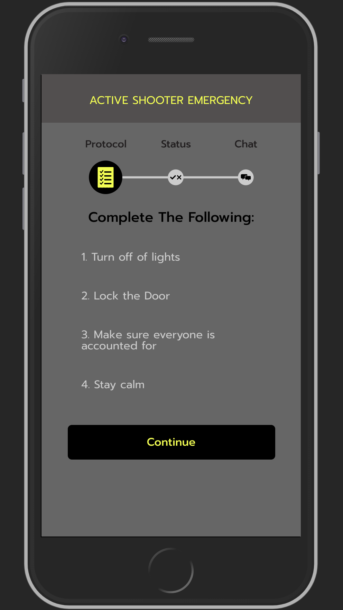
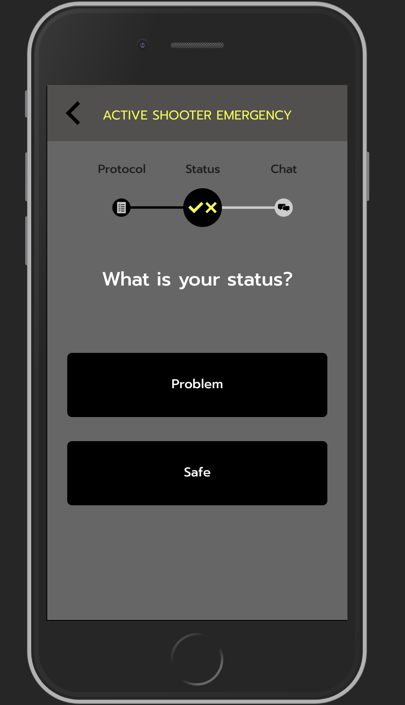
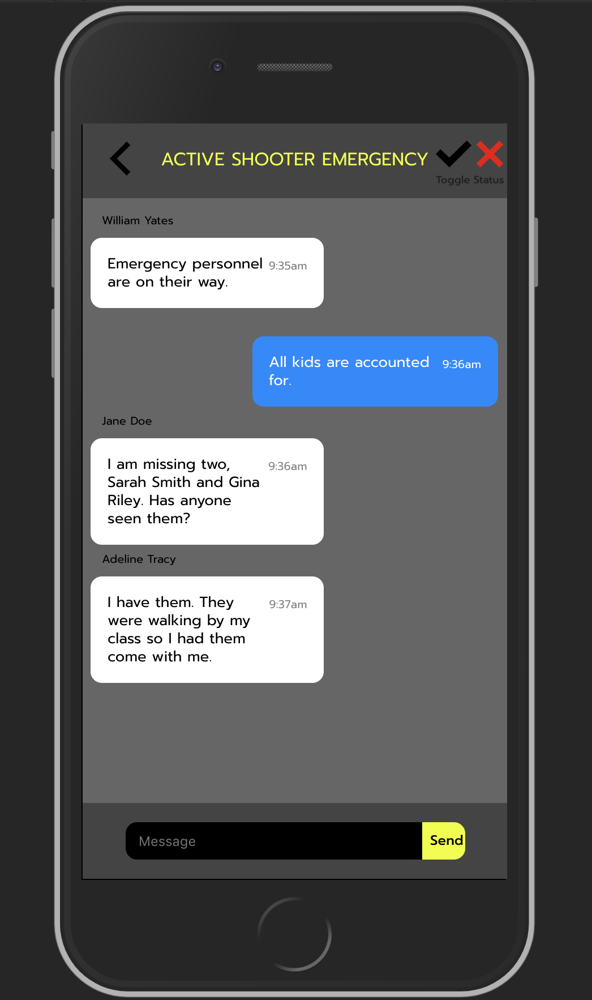
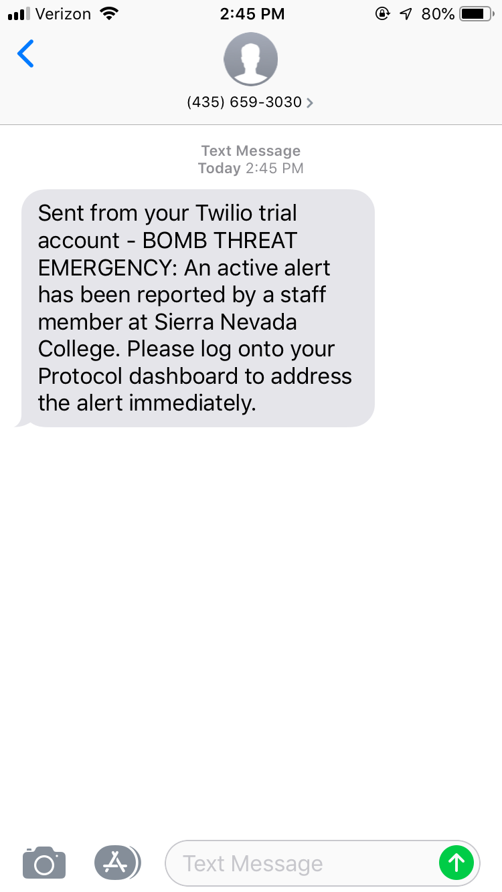
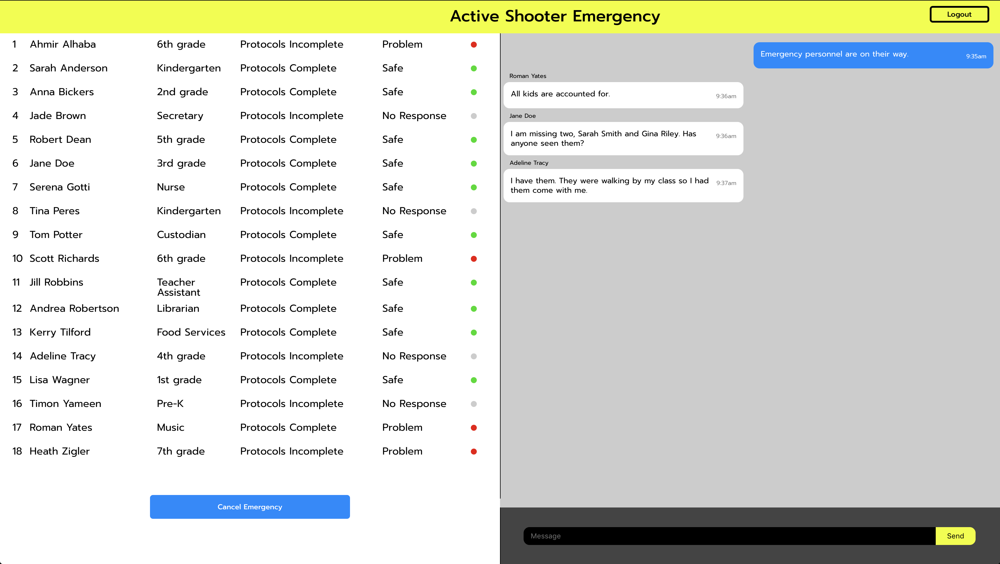
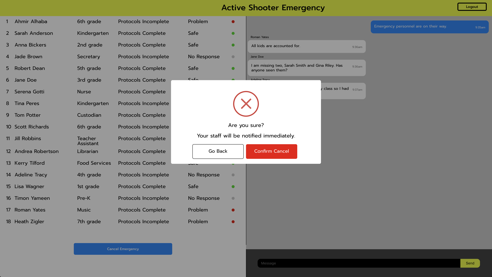
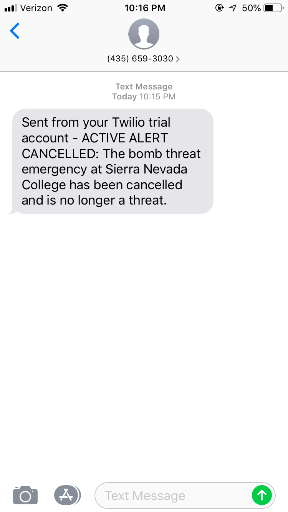

